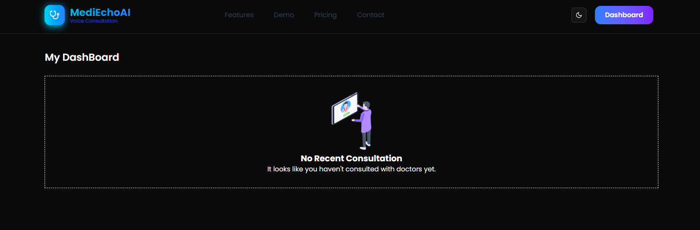
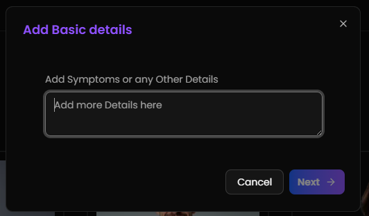
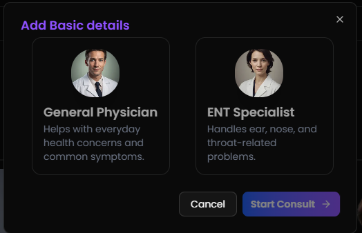
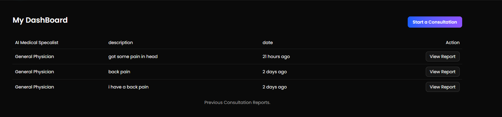
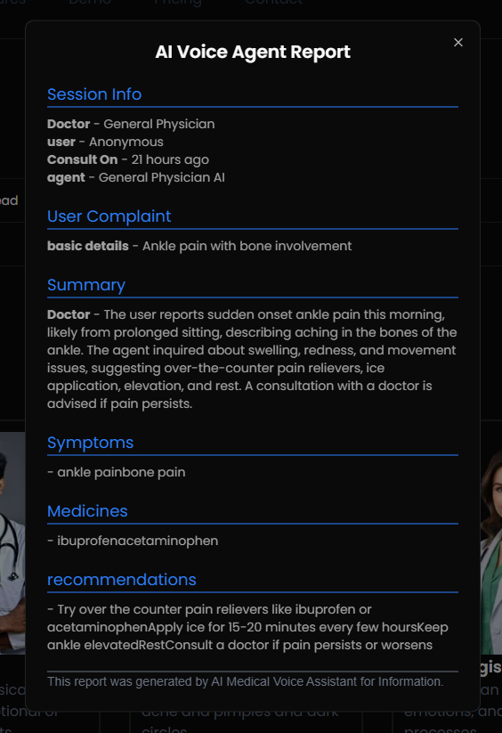

# 🧠 AI Medical Voice Assistant

An intelligent, full-stack AI-powered Medical Voice Consultation SaaS platform built with modern web technologies like Next.js App Router, Prisma, PostgreSQL, Clerk for auth, OpenAI for intelligent answers, and Vapi for voice responses.

---

## 🔧 Tech Stack

- **Frontend:** Next.js 14 (App Router) + Tailwind CSS
- **Backend:** Next.js API routes + Prisma ORM
- **Database:** PostgreSQL (hosted on Supabase)
- **Authentication:** Clerk
- **AI:** OpenAI GPT models (via API)
- **Voice Assistant:** Vapi SDK
- **Payments:** Clerk Billing (Optional SaaS monetization)

---

## 🌟 Features

✅ AI-powered Consult with Doctor       
✅ Based on your note Generate a specalist doctor       
✅ Voice-based Q&A with Vapi  
✅ 10+ doctor specalist for every
✅ Generate a Report Using your chat with doctor      
✅ Secure authentication with Clerk         
✅ Persistent history using Supabase + Prisma  
✅ Clean and modern UI with Tailwind  
✅ SaaS-ready structure for monetization  
✅ Responsive website (mobile, tablet, laptop)

---










## 🔐 Environment Variables

Create a `.env.local` file in the root with the following variables:

```env
DATABASE_URL=postgresql://<your-db-url>
OPENAI_API_KEY=sk-...
CLERK_SECRET_KEY=...
VAPI_API_KEY=...
